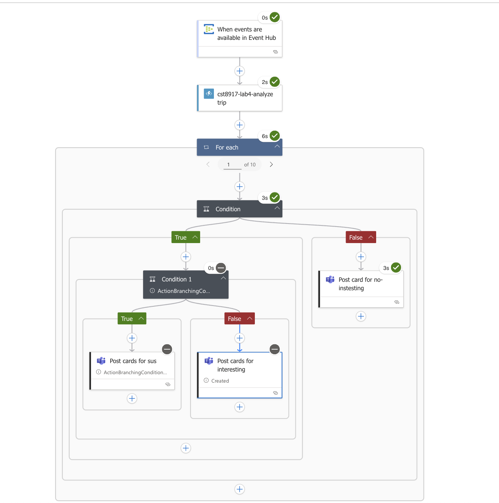

# cst8917-lab4

Youtube link: https://youtu.be/uBzmVBUQh-8
## architecture and Logic App steps

As shown in , from top to down, We have the workflow that:
1. Trigger by event hub once less than 10 events are sent to the hub
2. The events will be grabbed and sent to cloud function for analyzing
3. For each item from analyzed result array, see if it is `interesting`
4. If `Interesting`:
    - see it it contains `insights` and `SuspiciousVendorActivity`
        - if `true`, send the `suspecious` card in teams
        - if `false`, send the `interesting` card in teams
5. If `not interesting`, send the `not-interesting` card in teams

## Description of your Azure Function logic

It analyze the trip data, which 
1. HTTP Triggered: This Azure Function is activated when it receives an HTTP request.

2. Flexible Input: It can handle trip data provided as a single JSON object or as a list of JSON objects.

3. Insight Generation: For each trip, it extracts details like vendorID, tripDistance, passengerCount, and paymentType. Based on these, it generates specific "insights" such as "LongTrip", "GroupRide", "CashPayment", and "SuspiciousVendorActivity" (if a cash payment is made for a very short trip).

4. Structured Output: The function returns a JSON array where each item includes the original trip details, any identified insights, a boolean isInteresting flag (true if insights exist), and a summary of the flags. It also includes error handling for robust operation.

## Example input/output

Event hub input:
```json
[
  {
    "ContentData": {
      "vendorID": "5",
      "tpepPickupDateTime": 1528119858000,
      "tpepDropoffDateTime": 1528121148000,
      "passengerCount": 3,
      "tripDistance": 9.49,
      "puLocationId": "186",
      "doLocationId": "230",
      "startLon": null,
      "startLat": null,
      "endLon": null,
      "endLat": null,
      "rateCodeId": 1,
      "storeAndFwdFlag": "N",
      "paymentType": 1,
      "fareAmount": 13.5,
      "extra": 0,
      "mtaTax": 0.5,
      "improvementSurcharge": "0.3",
      "tipAmount": 2.86,
      "tollsAmount": 0,
      "totalAmount": 17.16
    },
    "Properties": {
      "x-opt-sequence-number-epoch": -1,
      "x-opt-sequence-number": 11,
      "x-opt-offset": "4294967296",
      "x-opt-enqueued-time": "2025-07-26T00:33:12.261Z",
      "message-id": {
        "EncodeSize": 49
      },
      "correlation-id": {
        "EncodeSize": 38
      },
      "content-type": {
        "Value": "application/json",
        "ValueSize": 16
      }
    },
    "SystemProperties": {
      "EnqueuedTimeUtc": "2025-07-26T00:33:12.261Z",
      "Offset": "4294967296",
      "PartitionKey": null,
      "SequenceNumber": 11
    }
  },
  {
    "ContentData": {
      "vendorID": "2",
      "tpepPickupDateTime": 1528119858000,
      "tpepDropoffDateTime": 1528121148000,
      "passengerCount": 2,
      "tripDistance": 1.2,
      "puLocationId": "186",
      "doLocationId": "230",
      "startLon": null,
      "startLat": null,
      "endLon": null,
      "endLat": null,
      "rateCodeId": 1,
      "storeAndFwdFlag": "N",
      "paymentType": 1,
      "fareAmount": 13.5,
      "extra": 0,
      "mtaTax": 0.5,
      "improvementSurcharge": "0.3",
      "tipAmount": 2.86,
      "tollsAmount": 0,
      "totalAmount": 17.16
    },
    "Properties": {
      "x-opt-sequence-number-epoch": -1,
      "x-opt-sequence-number": 12,
      "x-opt-offset": "4294968032",
      "x-opt-enqueued-time": "2025-07-26T00:33:12.261Z",
      "message-id": {
        "EncodeSize": 49
      },
      "correlation-id": {
        "EncodeSize": 38
      },
      "content-type": {
        "Value": "application/json",
        "ValueSize": 16
      }
    },
    "SystemProperties": {
      "EnqueuedTimeUtc": "2025-07-26T00:33:12.261Z",
      "Offset": "4294968032",
      "PartitionKey": null,
      "SequenceNumber": 12
    }
  },
  {
    "ContentData": {
      "vendorID": "4",
      "tpepPickupDateTime": 1528119858000,
      "tpepDropoffDateTime": 1528121148000,
      "passengerCount": 1,
      "tripDistance": 2.1,
      "puLocationId": "186",
      "doLocationId": "230",
      "startLon": null,
      "startLat": null,
      "endLon": null,
      "endLat": null,
      "rateCodeId": 1,
      "storeAndFwdFlag": "N",
      "paymentType": 1,
      "fareAmount": 13.5,
      "extra": 0,
      "mtaTax": 0.5,
      "improvementSurcharge": "0.3",
      "tipAmount": 2.86,
      "tollsAmount": 0,
      "totalAmount": 17.16
    },
    "Properties": {
      "x-opt-sequence-number-epoch": -1,
      "x-opt-sequence-number": 13,
      "x-opt-offset": "4294968768",
      "x-opt-enqueued-time": "2025-07-26T00:33:12.261Z",
      "message-id": {
        "EncodeSize": 49
      },
      "correlation-id": {
        "EncodeSize": 38
      },
      "content-type": {
        "Value": "application/json",
        "ValueSize": 16
      }
    },
    "SystemProperties": {
      "EnqueuedTimeUtc": "2025-07-26T00:33:12.261Z",
      "Offset": "4294968768",
      "PartitionKey": null,
      "SequenceNumber": 13
    }
  },
  {
    "ContentData": {
      "vendorID": "2",
      "tpepPickupDateTime": 1528119858000,
      "tpepDropoffDateTime": 1528121148000,
      "passengerCount": 1,
      "tripDistance": 6.85,
      "puLocationId": "186",
      "doLocationId": "230",
      "startLon": null,
      "startLat": null,
      "endLon": null,
      "endLat": null,
      "rateCodeId": 1,
      "storeAndFwdFlag": "N",
      "paymentType": 3,
      "fareAmount": 13.5,
      "extra": 0,
      "mtaTax": 0.5,
      "improvementSurcharge": "0.3",
      "tipAmount": 2.86,
      "tollsAmount": 0,
      "totalAmount": 17.16
    },
    "Properties": {
      "x-opt-sequence-number-epoch": -1,
      "x-opt-sequence-number": 14,
      "x-opt-offset": "4294969504",
      "x-opt-enqueued-time": "2025-07-26T00:33:12.261Z",
      "message-id": {
        "EncodeSize": 49
      },
      "correlation-id": {
        "EncodeSize": 38
      },
      "content-type": {
        "Value": "application/json",
        "ValueSize": 16
      }
    },
    "SystemProperties": {
      "EnqueuedTimeUtc": "2025-07-26T00:33:12.261Z",
      "Offset": "4294969504",
      "PartitionKey": null,
      "SequenceNumber": 14
    }
  },
  {
    "ContentData": {
      "vendorID": "4",
      "tpepPickupDateTime": 1528119858000,
      "tpepDropoffDateTime": 1528121148000,
      "passengerCount": 3,
      "tripDistance": 9.76,
      "puLocationId": "186",
      "doLocationId": "230",
      "startLon": null,
      "startLat": null,
      "endLon": null,
      "endLat": null,
      "rateCodeId": 1,
      "storeAndFwdFlag": "N",
      "paymentType": 3,
      "fareAmount": 13.5,
      "extra": 0,
      "mtaTax": 0.5,
      "improvementSurcharge": "0.3",
      "tipAmount": 2.86,
      "tollsAmount": 0,
      "totalAmount": 17.16
    },
    "Properties": {
      "x-opt-sequence-number-epoch": -1,
      "x-opt-sequence-number": 15,
      "x-opt-offset": "4294970240",
      "x-opt-enqueued-time": "2025-07-26T00:33:12.261Z",
      "message-id": {
        "EncodeSize": 49
      },
      "correlation-id": {
        "EncodeSize": 38
      },
      "content-type": {
        "Value": "application/json",
        "ValueSize": 16
      }
    },
    "SystemProperties": {
      "EnqueuedTimeUtc": "2025-07-26T00:33:12.261Z",
      "Offset": "4294970240",
      "PartitionKey": null,
      "SequenceNumber": 15
    }
  },
  {
    "ContentData": {
      "vendorID": "3",
      "tpepPickupDateTime": 1528119858000,
      "tpepDropoffDateTime": 1528121148000,
      "passengerCount": 1,
      "tripDistance": 6.4,
      "puLocationId": "186",
      "doLocationId": "230",
      "startLon": null,
      "startLat": null,
      "endLon": null,
      "endLat": null,
      "rateCodeId": 1,
      "storeAndFwdFlag": "N",
      "paymentType": 3,
      "fareAmount": 13.5,
      "extra": 0,
      "mtaTax": 0.5,
      "improvementSurcharge": "0.3",
      "tipAmount": 2.86,
      "tollsAmount": 0,
      "totalAmount": 17.16
    },
    "Properties": {
      "x-opt-sequence-number-epoch": -1,
      "x-opt-sequence-number": 16,
      "x-opt-offset": "4294970976",
      "x-opt-enqueued-time": "2025-07-26T00:33:12.261Z",
      "message-id": {
        "EncodeSize": 49
      },
      "correlation-id": {
        "EncodeSize": 38
      },
      "content-type": {
        "Value": "application/json",
        "ValueSize": 16
      }
    },
    "SystemProperties": {
      "EnqueuedTimeUtc": "2025-07-26T00:33:12.261Z",
      "Offset": "4294970976",
      "PartitionKey": null,
      "SequenceNumber": 16
    }
  },
  {
    "ContentData": {
      "vendorID": "5",
      "tpepPickupDateTime": 1528119858000,
      "tpepDropoffDateTime": 1528121148000,
      "passengerCount": 2,
      "tripDistance": 9.66,
      "puLocationId": "186",
      "doLocationId": "230",
      "startLon": null,
      "startLat": null,
      "endLon": null,
      "endLat": null,
      "rateCodeId": 1,
      "storeAndFwdFlag": "N",
      "paymentType": 2,
      "fareAmount": 13.5,
      "extra": 0,
      "mtaTax": 0.5,
      "improvementSurcharge": "0.3",
      "tipAmount": 2.86,
      "tollsAmount": 0,
      "totalAmount": 17.16
    },
    "Properties": {
      "x-opt-sequence-number-epoch": -1,
      "x-opt-sequence-number": 17,
      "x-opt-offset": "4294971712",
      "x-opt-enqueued-time": "2025-07-26T00:33:12.261Z",
      "message-id": {
        "EncodeSize": 49
      },
      "correlation-id": {
        "EncodeSize": 38
      },
      "content-type": {
        "Value": "application/json",
        "ValueSize": 16
      }
    },
    "SystemProperties": {
      "EnqueuedTimeUtc": "2025-07-26T00:33:12.261Z",
      "Offset": "4294971712",
      "PartitionKey": null,
      "SequenceNumber": 17
    }
  },
  {
    "ContentData": {
      "vendorID": "1",
      "tpepPickupDateTime": 1528119858000,
      "tpepDropoffDateTime": 1528121148000,
      "passengerCount": 3,
      "tripDistance": 1.09,
      "puLocationId": "186",
      "doLocationId": "230",
      "startLon": null,
      "startLat": null,
      "endLon": null,
      "endLat": null,
      "rateCodeId": 1,
      "storeAndFwdFlag": "N",
      "paymentType": 3,
      "fareAmount": 13.5,
      "extra": 0,
      "mtaTax": 0.5,
      "improvementSurcharge": "0.3",
      "tipAmount": 2.86,
      "tollsAmount": 0,
      "totalAmount": 17.16
    },
    "Properties": {
      "x-opt-sequence-number-epoch": -1,
      "x-opt-sequence-number": 18,
      "x-opt-offset": "4294972448",
      "x-opt-enqueued-time": "2025-07-26T00:33:12.261Z",
      "message-id": {
        "EncodeSize": 49
      },
      "correlation-id": {
        "EncodeSize": 38
      },
      "content-type": {
        "Value": "application/json",
        "ValueSize": 16
      }
    },
    "SystemProperties": {
      "EnqueuedTimeUtc": "2025-07-26T00:33:12.261Z",
      "Offset": "4294972448",
      "PartitionKey": null,
      "SequenceNumber": 18
    }
  },
  {
    "ContentData": {
      "vendorID": "1",
      "tpepPickupDateTime": 1528119858000,
      "tpepDropoffDateTime": 1528121148000,
      "passengerCount": 3,
      "tripDistance": 8.05,
      "puLocationId": "186",
      "doLocationId": "230",
      "startLon": null,
      "startLat": null,
      "endLon": null,
      "endLat": null,
      "rateCodeId": 1,
      "storeAndFwdFlag": "N",
      "paymentType": 3,
      "fareAmount": 13.5,
      "extra": 0,
      "mtaTax": 0.5,
      "improvementSurcharge": "0.3",
      "tipAmount": 2.86,
      "tollsAmount": 0,
      "totalAmount": 17.16
    },
    "Properties": {
      "x-opt-sequence-number-epoch": -1,
      "x-opt-sequence-number": 19,
      "x-opt-offset": "4294973184",
      "x-opt-enqueued-time": "2025-07-26T00:33:12.261Z",
      "message-id": {
        "EncodeSize": 49
      },
      "correlation-id": {
        "EncodeSize": 38
      },
      "content-type": {
        "Value": "application/json",
        "ValueSize": 16
      }
    },
    "SystemProperties": {
      "EnqueuedTimeUtc": "2025-07-26T00:33:12.261Z",
      "Offset": "4294973184",
      "PartitionKey": null,
      "SequenceNumber": 19
    }
  },
  {
    "ContentData": {
      "vendorID": "4",
      "tpepPickupDateTime": 1528119858000,
      "tpepDropoffDateTime": 1528121148000,
      "passengerCount": 1,
      "tripDistance": 3.01,
      "puLocationId": "186",
      "doLocationId": "230",
      "startLon": null,
      "startLat": null,
      "endLon": null,
      "endLat": null,
      "rateCodeId": 1,
      "storeAndFwdFlag": "N",
      "paymentType": 1,
      "fareAmount": 13.5,
      "extra": 0,
      "mtaTax": 0.5,
      "improvementSurcharge": "0.3",
      "tipAmount": 2.86,
      "tollsAmount": 0,
      "totalAmount": 17.16
    },
    "Properties": {
      "x-opt-sequence-number-epoch": -1,
      "x-opt-sequence-number": 20,
      "x-opt-offset": "4294973920",
      "x-opt-enqueued-time": "2025-07-26T00:33:12.261Z",
      "message-id": {
        "EncodeSize": 49
      },
      "correlation-id": {
        "EncodeSize": 38
      },
      "content-type": {
        "Value": "application/json",
        "ValueSize": 16
      }
    },
    "SystemProperties": {
      "EnqueuedTimeUtc": "2025-07-26T00:33:12.261Z",
      "Offset": "4294973920",
      "PartitionKey": null,
      "SequenceNumber": 20
    }
  }
]
```

Cloud function output:
```json
{
  "statusCode": 200,
  "headers": {
    "Date": "Sat, 26 Jul 2025 00:33:35 GMT",
    "Server": "Kestrel",
    "Transfer-Encoding": "chunked",
    "Content-Type": "application/json",
    "Content-Length": "1498"
  },
  "body": [
    {
      "vendorID": "5",
      "tripDistance": 9.49,
      "passengerCount": 3,
      "paymentType": "1",
      "insights": [],
      "isInteresting": false,
      "summary": "Trip normal"
    },
    {
      "vendorID": "2",
      "tripDistance": 1.2,
      "passengerCount": 2,
      "paymentType": "1",
      "insights": [],
      "isInteresting": false,
      "summary": "Trip normal"
    },
    {
      "vendorID": "4",
      "tripDistance": 2.1,
      "passengerCount": 1,
      "paymentType": "1",
      "insights": [],
      "isInteresting": false,
      "summary": "Trip normal"
    },
    {
      "vendorID": "2",
      "tripDistance": 6.85,
      "passengerCount": 1,
      "paymentType": "3",
      "insights": [],
      "isInteresting": false,
      "summary": "Trip normal"
    },
    {
      "vendorID": "4",
      "tripDistance": 9.76,
      "passengerCount": 3,
      "paymentType": "3",
      "insights": [],
      "isInteresting": false,
      "summary": "Trip normal"
    },
    {
      "vendorID": "3",
      "tripDistance": 6.4,
      "passengerCount": 1,
      "paymentType": "3",
      "insights": [],
      "isInteresting": false,
      "summary": "Trip normal"
    },
    {
      "vendorID": "5",
      "tripDistance": 9.66,
      "passengerCount": 2,
      "paymentType": "2",
      "insights": [
        "CashPayment"
      ],
      "isInteresting": true,
      "summary": "1 flags: CashPayment"
    },
    {
      "vendorID": "1",
      "tripDistance": 1.09,
      "passengerCount": 3,
      "paymentType": "3",
      "insights": [],
      "isInteresting": false,
      "summary": "Trip normal"
    },
    {
      "vendorID": "1",
      "tripDistance": 8.05,
      "passengerCount": 3,
      "paymentType": "3",
      "insights": [],
      "isInteresting": false,
      "summary": "Trip normal"
    },
    {
      "vendorID": "4",
      "tripDistance": 3.01,
      "passengerCount": 1,
      "paymentType": "1",
      "insights": [],
      "isInteresting": false,
      "summary": "Trip normal"
    }
  ]
}
```

